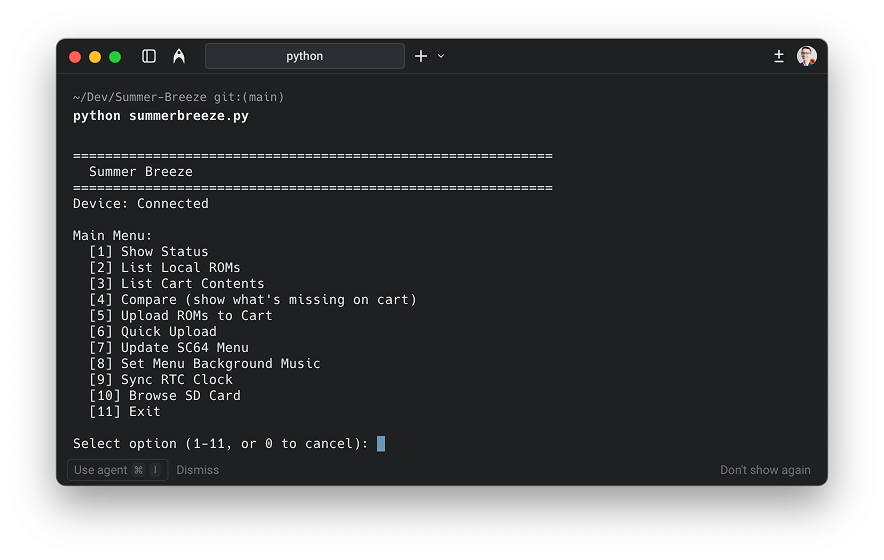

# Summer Breeze

[](https://github.com/TheLeggett/Summer-Breeze/actions/workflows/ci.yml)
[](https://opensource.org/licenses/MIT)

A user-friendly CLI tool for managing ROMs on your SummerCart64 flash cart.



## Requirements

- Python 3.10+
- SummerCart64 connected via USB
- `sc64deployer` binary (see setup below)

## Setup

### macOS

1. Download the latest release from [SummerCart64 releases](https://github.com/Polprzewodnikowy/SummerCart64/releases)
2. Download the **macOS** asset (e.g., `sc64-deployer-macos-v2.20.2.zip`)
3. Extract the zip and copy `sc64deployer` to this directory (same folder as `summerbreeze.py`)
4. Make it executable: `chmod +x sc64deployer`

### Windows

1. Download the latest release from [SummerCart64 releases](https://github.com/Polprzewodnikowy/SummerCart64/releases)
2. Download the **Windows** asset (e.g., `sc64-deployer-windows-v2.20.2.zip`)
3. Extract the zip and copy `sc64deployer.exe` to this directory (same folder as `summerbreeze.py`)

### Linux

1. Download the latest release from [SummerCart64 releases](https://github.com/Polprzewodnikowy/SummerCart64/releases)
2. Download the **Linux** asset (e.g., `sc64-deployer-linux-v2.20.2.zip`)
3. Extract the zip and copy `sc64deployer` to this directory (same folder as `summerbreeze.py`)
4. Make it executable: `chmod +x sc64deployer`

## Directory Structure

```
Summer-Breeze/
├── summerbreeze.py     # This CLI tool
├── sc64deployer.exe    # Official SC64 deployer (Windows)
├── sc64deployer        # Official SC64 deployer (macOS/Linux)
├── roms/               # Put your ROM files here
│   ├── Game1.z64
│   ├── Game2.n64
│   └── ...
├── menu_versions/      # Put SC64 menu files here for updates
│   ├── sc64menu-v1.0.z64
│   └── ...
├── menu_music/         # Put MP3 files here for menu background music
│   └── background.mp3
└── README.md
```

## Usage

```bash
python summerbreeze.py
```

The interactive menu provides these options:

1. **Show Status** - Check device connection and SD card status
2. **List Local ROMs** - Show all ROMs in your local `roms/` folder
3. **List Cart Contents** - Show all ROMs on the SD card
4. **Compare** - Show which local ROMs are missing from the cart
5. **Upload ROMs to Cart** - Select ROMs and destination folder to upload
6. **Quick Upload** - Upload ROMs directly to SD card root
7. **Update SC64 Menu** - Update the menu firmware on your cart
8. **Set Menu Background Music** - Set custom menu music (requires [custom menu](https://github.com/TheLeggett/N64FlashcartMenu))
9. **Sync RTC Clock** - Synchronize the cart's clock with your system time
10. **Browse SD Card** - Interactive browser for SD card contents

## Important: SD Card Access

The SC64's SD card is only accessible when your **N64 is powered ON**.

If you see "SD card: Not initialized", turn on your N64 and try again.

## Uploading ROMs

1. The tool shows ROMs not yet on the cart
2. Select ROMs by number (e.g., `1,3,5`) or type `all`
3. Choose destination folder (root `/` or custom path like `/games`)
4. ROMs are uploaded one at a time with progress shown

## Supported ROM Formats

- `.z64` - Big-endian (native N64 format)
- `.n64` - Little-endian
- `.v64` - Byte-swapped

## Troubleshooting

### "Device: NOT CONNECTED"
- Check USB cable connection
- Try a different USB port
- Ensure SC64 is properly seated in the N64 cartridge slot

### "SD card: Not initialized"
- Power ON your N64 console
- Wait a few seconds for the menu to boot
- Try again

### "sc64deployer not found"
- Download the appropriate `sc64deployer` binary for your OS from the [SummerCart64 releases](https://github.com/Polprzewodnikowy/SummerCart64/releases)
- Place it in the same directory as `summerbreeze.py`
- On macOS/Linux, make sure it's executable: `chmod +x sc64deployer`

## Development

### Setup

```bash
python3 -m venv .venv
source .venv/bin/activate
pip install ruff pytest
```

### Linting & Formatting

```bash
ruff check .        # Check for issues
ruff check --fix .  # Auto-fix issues
ruff format .       # Format code
```

### Testing

```bash
pytest -v
```

### CI

GitHub Actions runs linting and tests automatically on all pushes and pull requests. Tests run against Python 3.10, 3.11, and 3.12.

## Credits

- [SummerCart64](https://github.com/Polprzewodnikowy/SummerCart64) by Polprzewodnikowy
- [N64FlashcartMenu](https://github.com/Polprzewodnikowy/N64FlashcartMenu) (sc64menu.n64)
